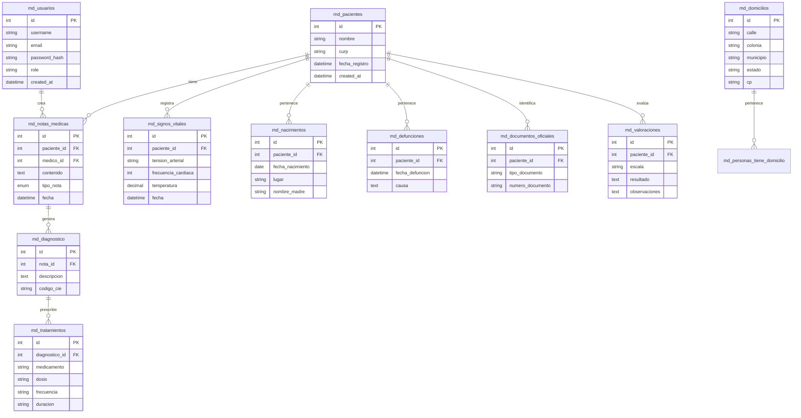

# 🏥 Medical Register API (Módulo de Registros Médicos)


API robusta y escalable diseñada para la gestión integral de registros médicos en un entorno hospitalario. Implementa autenticación segura, relaciones complejas de base de datos y documentación interactiva.

## 🚀 Tecnologías Utilizadas

- **Python 3.12+**: Lenguaje de programación base.
- **FastAPI**: Framework moderno y de alto rendimiento para construir APIs.
- **MySQL**: Sistema de gestión de base de datos relacional.
- **SQLAlchemy**: ORM para la gestión eficiente de modelos y relaciones.
- **JWT (JSON Web Tokens)**: Sistema de autenticación y autorización.
- **Bcrypt**: Encriptación de alta seguridad para contraseñas.
- **Uvicorn**: Servidor ASGI de alto rendimiento.

## 🛠️ Instalación y Configuración

Siga estos pasos para desplegar el servidor localmente en Windows:

1. **Clonar el repositorio**:
   ```powershell
   git clone https://github.com/AngelJdev/MEDICAL_REGISTER_API.git
   cd MEDICAL_REGISTER_API
   ```

2. **Crear y activar entorno virtual**:
   ```powershell
   python -m venv venv
   .\venv\Scripts\activate
   ```

3. **Instalar dependencias**:
   ```powershell
   pip install -r requirements.txt
   ```

4. **Configurar base de datos**:
   Asegúrese de tener un archivo `.env` configurado con sus credenciales de MySQL:
   ```env
   DB_USER=root
   DB_PASSWORD=tu_password
   DB_HOST=localhost
   DB_PORT=3306
   DB_NAME=medical_register_db
   SECRET_KEY=tu_secreto_para_jwt
   ```

5. **Inicializar y Sembrar DB**:
   ```powershell
   python seed_db.py
   ```

6. **Iniciar servidor**:
   ```powershell
   python main.py
   ```

## 📊 Diagrama Entidad-Relación (ERD)

Estructura relacional completa diseñada para mantener la integridad referencial:




Desarrollado con ❤️ por el equipo de Registros Médicos.
