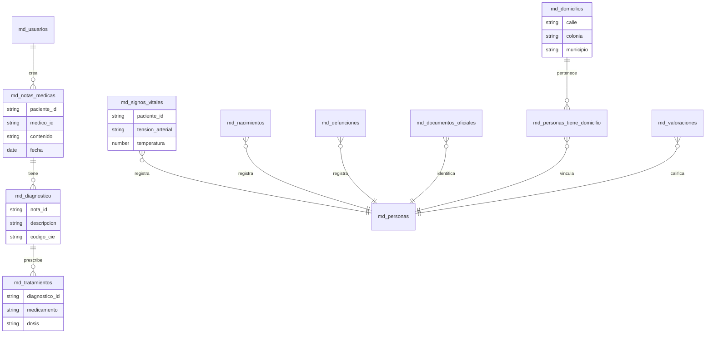

# Medical Register API (Módulo de Registros Médicos)

Esta es una API robusta construida con el stack MERN (Node.js, Express, MongoDB) para gestionar el módulo de Registros Médicos de un sistema de salud. Incluye autenticación mediante JWT y protección de rutas.

## Tecnologías Utilizadas

- **Node.js**: Entorno de ejecución para JavaScript.
- **Express.js**: Framework para el desarrollo de APIs.
- **MongoDB Atlas**: Base de Datos NoSQL en la nube.
- **Mongoose**: ODM para el modelado de datos.
- **JWT (JSON Web Tokens)**: Seguridad y autenticación de usuarios.
- **Bcryptjs**: Encriptación de contraseñas.
- **Cors**: Control de acceso de recursos cruzados.

## Instalación y Configuración

Siga estos pasos para inicializar el proyecto localmente:

1. **Clonar el repositorio**:
   ```bash
   git clone <url-del-repositorio>
   cd medical-register-api
   ```

2. **Instalar dependencias**:
   ```bash
   npm install
   ```

3. **Configurar variables de entorno**:
   Cree un archivo `.env` en la raíz del proyecto con el siguiente contenido (reemplace con sus credenciales de MongoDB Atlas):
   ```env
   PORT=5000
   MONGODB_URI=mongodb+srv://<usuario>:<password>@cluster.mongodb.net/medical_register
   JWT_SECRET=tu_secreto_super_seguro
   NODE_ENV=development
   ```

4. **Iniciar el servidor**:
   ```bash
   npm start
   ```
   *Nota: Asegúrese de tener configurado el script "start" en su package.json.*

## Diagrama de Entidad-Relación (ERD)

A continuación se presenta la estructura de las colecciones utilizadas (todas con el prefijo `md_`):



## Endpoints Principales

Todos los endpoints médicos requieren el encabezado `Authorization: Bearer <token>`.

- **Auth**: `POST /api/auth/login`, `POST /api/auth/register`
- **Notas Médicas**: `/api/medical/notas-medicas`
- **Signos Vitales**: `/api/medical/signos-vitales`
- **Diagnóstico**: `/api/medical/diagnostico`
- **Tratamientos**: `/api/medical/tratamientos`
- **Nacimientos**: `/api/medical/nacimientos`
- **Defunciones**: `/api/medical/defunciones`
- **Documentos Oficiales**: `/api/medical/documentos-oficiales`
- **Domicilios**: `/api/medical/domicilios`
- **Personas-Domicilio**: `/api/medical/personas-domicilio`
- **Valoraciones**: `/api/medical/valoraciones`
